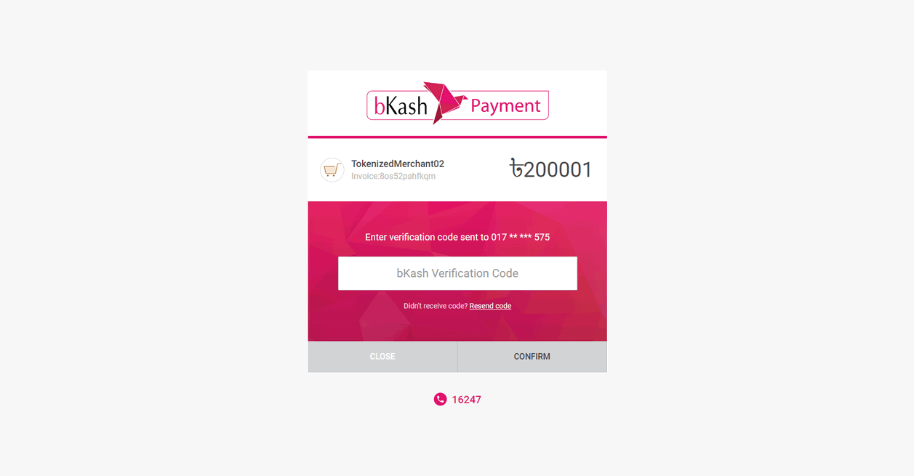

# junior-dev-frontend

## FRONTEND

### Packages
- react
- react-hook-form
- react-icons
- react-router-dom
- react-spinners
- react-toastify

## Features
- Customer Login/Registration Page
- Admin/Customer can add product.
- customer can buy single product or their cart products.
- customer can add product into carts that store inside database.
- customer can payment with bkash.
- Search via title.

## Route

#### authentication
- /join/login [Public] Login Page
- /join/new [public] create a new account

#### products

- GET / [Public] homepage show list of products
- POST /add-products [PRIVATE] add product page

### carts
- add Cart 
- delete cart

#### bkash payment
- POST /bkash/createPayment [PRIVATE] create payment
- GET bkash/execute agreement and create payment
- GET bkash/status [PRIVATE] get payment status

#### Hompage

#### Search Product

#### Add Product page [PRIVATE ROUTE]

#### Regstration page

#### Checkout page

#### Payment page

#### Confirm Modal

#### Orders

### Transaction
